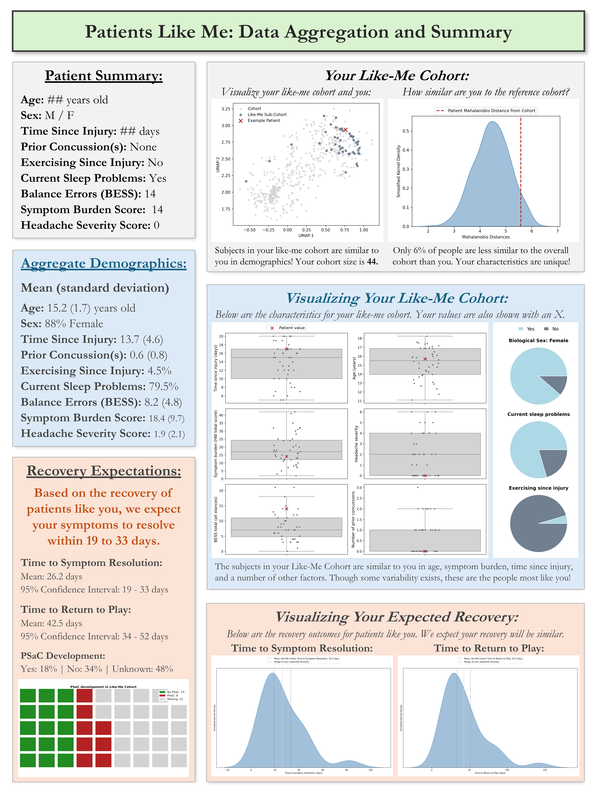
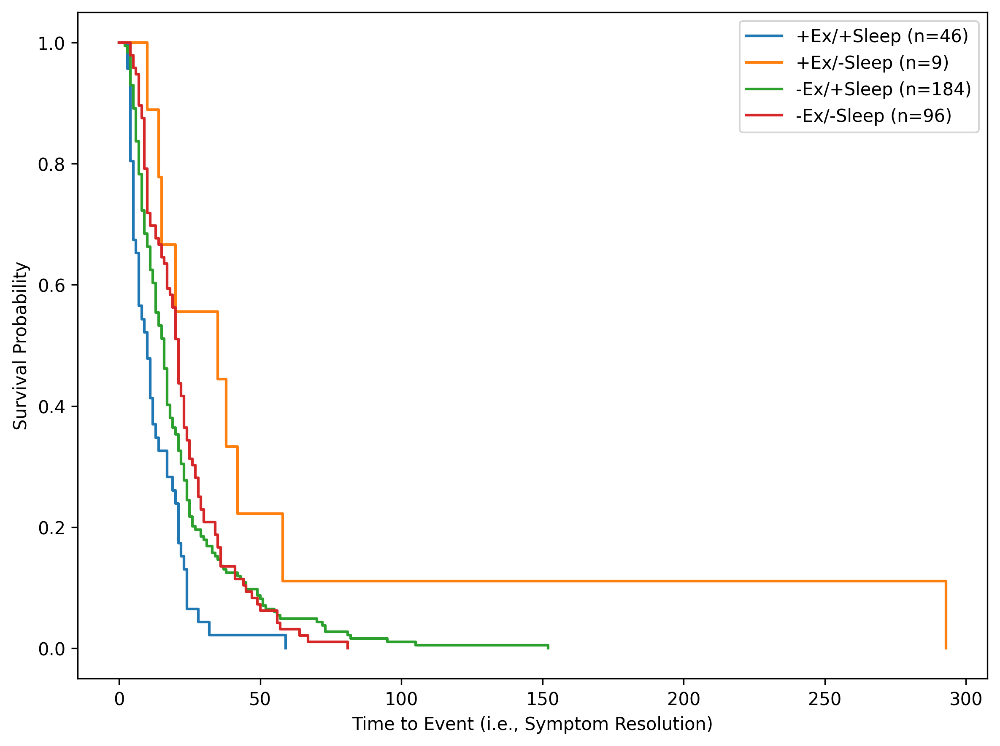
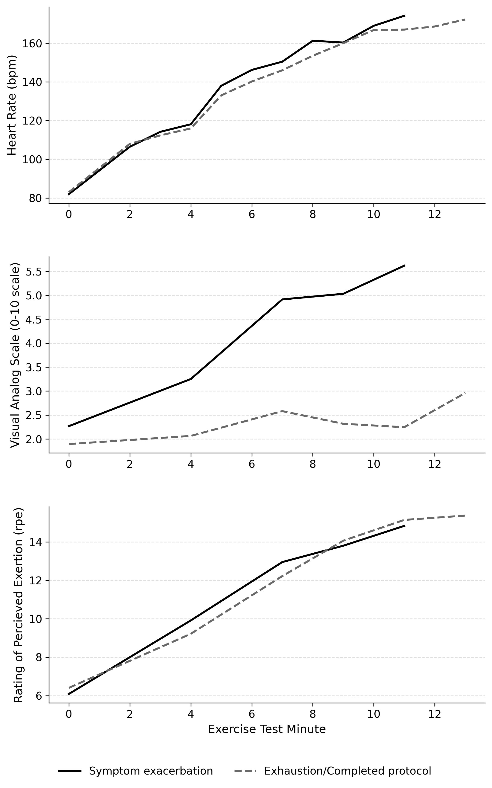
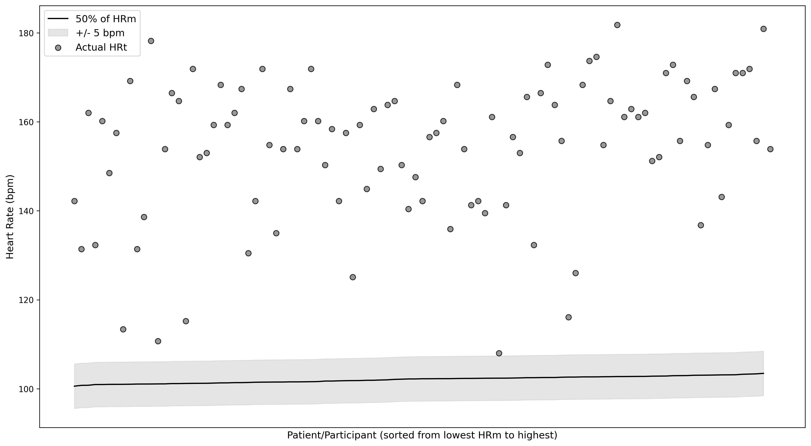
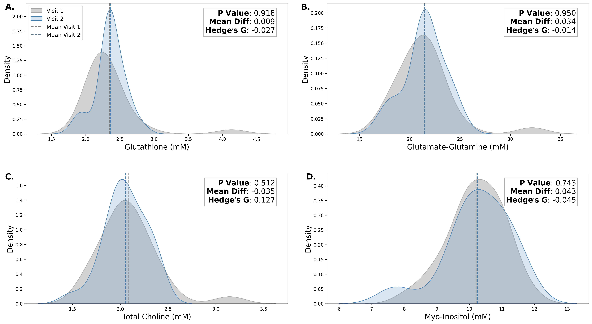
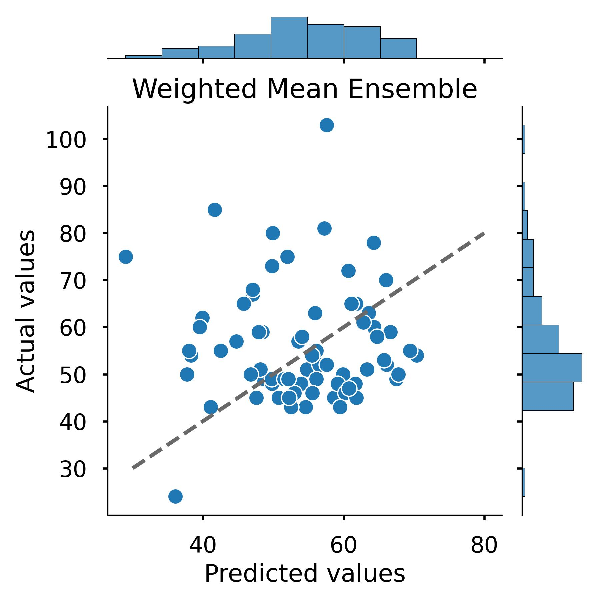

## Hi, I'm Mathew! 

**Name:** Mathew Wingerson (he/him)  
**Location:** Denver, CO (relocating to... tbd)  
**Job:** Data Science, Health Analytics, and Machine Learning Researcher (PhD Candidate, expected graudation: May 2026)  
**Company:** University of Colorado School of Medicine | [Colorado Concussion Research Laboratory](https://medschool.cuanschutz.edu/orthopedics/research/labs/howell-concussion-lab)  
**Email:** Mat.Wingerson@gmail.com | Mathew.Wingerson@CUAnschutz.edu  
 
[GitHub Homepage (@WingersonMJ)](https://github.com/wingersonMJ) || [LinkedIn](https://www.linkedin.com/in/mat-wingerson/) || [My CV - Updated Regularly](https://github.com/wingersonMJ/Curriculum-Vitae/tree/main)  
 

--- 
## Professional Summary

I am passionate about identifying patterns in data and using data-driven decisions to effect change in healthcare and health sciences research. I have a strong educational background and significant real-world experience in applied statistics and data sciences, including modern machine learning and deep learning architectures. I enjoy using my knowledge to contribute collaboratively on research that impacts clinical practice and provision of medicine.  

My 6 years of experience in clinical research and statistics, and 3+ years of processing and integrating multimodal data sources (text, clinical, electronic-health-record, wearable, biologic, continuous- and discrete-time), and applying AI and ML techniques (neural networks, clustering, tree-based classifiers, etc.) have prepared me for a position as a Health Sciences Researcher. 

---

## Education

### Doctor of Philosophy: Rehabilitation Sciences
Expected: May 2026  
University of Colorado Anschutz School of Medicine, Aurora, CO.  

### Certificate/Focus Area: Data Science and Health Analytics
Completed: October 2025.  
Conferred: May 2026.  
University of Colorado School of Public Health, Aurora, CO.  

### Master of Science: Applied Sport Psychology
Conferred: August 2021.  
Adams State University, Department of Kinesiology, Alamosa, CO.  

### Bachelor of Arts: Psychology
Conferred: December 2018.  
Simpson College, Department of Psychology, Indianola, IA.  

---

## Motivation...
I have a passion for identifying patterns in data and for using those patterns to make predictions and guide clinical management for medically complex injuries! I have a strong foundation in applied mathematics, including modern machine learning and deep learning architectures, and I enjoy using that knowledge to solve real-world problems. I am well-experienced in processing various data types (tabular, image, text), caplitalizing on a variety of feature sources (bench/clinical research, electronic medical records, imaging), and applying a diverse range of AI and ML techniques (Neural Networks, Clustering Algorithms, Tree-Based Classifiers, etc.) to predict health outcomes in children and adults. I am uniquely experienced in repeated measures and longitudinal data, including in my dissertation which explores discrete-time data (daily subject activity paterns) and in a side-project which explores continuous-time data (tri-axial accelerometer signal).  
 
I thrive when allowed to leverage conventional statistics, machine learning, and deep learning to make sense out of imperfect data. I am looking for a career that allows me to use these tools to tackle increasingly complex problems in fields where simple solutions fall short!  
 

## What I am looking for...
I am ahead of schedule in my progress toward a dissertation defense in 2026. I am currently searching for opportunities to use my passion and skills in AI and Machine Learning to contribute to a team of researchers looking to make an impact on real-world problems.  

**Link to my full CV:** [CV Link](https://github.com/wingersonMJ/Curriculum-Vitae/tree/main)  
 

## Tools I have learned...  
- Git (version control)
- Markdown
- **R, R-Studio, and R-Shiny** (4+ years)
- **Python** (3+ years) 
- VSCode IDE 
- Scikit Learn
- Pytorch and TensorFlow
- Conda/Anaconda (environment and dependency management)
- Docker (just getting started)
- Snakemake (workflow development)
- Pre-Commit (linting/formatting with Black, Ruff, isort)

## Work Examples: 

**Dissertation:** Longitudinal and joint-modeling analyses of repeated measures data for patients with concussion.  
Summary: Data processing and analysis workflows for longitudinal exploration of wearable device activity data in a 
clinical research setting, implementing functions to handle repeated measures, define patient-specific monitoring periods, 
and analyze using longitudinal and joint-modeling methods. 
[Project Repo](https://github.com/wingersonMJ/Dissertation_wingersonMJ)
 

**Like-Me Clinical Aggregation:** A framework for aggregating recovery outcomes among past patients based on similarity matching of clinical characteristics.  
Summary: This patients-like-me aggregation approach generates sub-cohorts that better reflect individual clinical presentations and recovery trajectories, offering an interpretable, data-driven complement to clinical management and supporting patient-centered discussions of expected recovery. 
[Project Repo](https://github.com/wingersonMJ/Like-Me_Clinical_Aggregation)  

  

    

      
    

    Click to view full image
  

  

 

**NeurIPS 2025 Submission:** Leveraging ordinal embeddings for predicting and generalizing health outcomes: A study of adolescent substance use.  
Summary: Deep representation learning for large-scale adolescent health data; introduced ordinal embeddings that outperform and better generalize to hold-out data than one-hot encoded baselines on substance-use risk prediction. 
[Project Repo](https://github.com/wingersonMJ/2025_NeurIPS_Submission/)
 

**Decision Tree:** A clinically intuitive approach to predicting persisting symptoms after concussion in adolescents.  
Summary: Interpretable decision-tree classifier for clinical use; tuning of hyperparameters, including depth, minimum samples per split, re-weighting for class imbalances, and cost-complexity pruning with selection of alpha value; stratified K-fold validation for model performance; bootstrapping with replacement for confidence intervals; variations of decision-tree visual representations for immediate use in clinical settings. 
[Project Repo](https://github.com/wingersonMJ/Decision_tree_prediction) 
 

**PropensityBatchRandomization:** A tool for randomizing participant biological samples across plates/batches while numerically evaluating the balance of key participant covariates post-randomization.  
Summary: Python package, published on PyPI, open source with tutorial; providing a structured tool for randomizing participant biological samples across plates/batches and numerically evaluating and balancing key participant covariates post-randomization; primary objective to mitigate batch effects encountered in analysis of biologics. 
[Project Repo](https://github.com/wingersonMJ/PropensityBatchRandomization) 
  

**Ensemble Learning of Proteomics Prediction Models:** This project is the start of model building for a study that uses proteomics to predict curve severity in patients with scoliosis.  
Summary: The objective is to take information gained about cellular functions, disease states, and biological pathways obtained from analyses of 7,500 proteins to estimate a patient's Max Cobb angle - the largest point of spinal curvature measured in degrees on an X-ray. I trained multiple neural networks to predict the target variable, then used ensemble learning by training a stacked linear regression on the network outputs. 
[Project Repo](https://github.com/wingersonMJ/Proteomics_Neural_Network_Ensemble)  

## Quick examples of contributions to science, clinical practice, and concussion rehabilitation:

**Combined effects of sleep and exercise:** Adolescents with acute concussion (sustained within 21-days of assessment) benefit from engagement in both post-injury exercise and quality sleep (i.e., +Ex/+Sleep group, blue) compared to 
engaging in one or neither of these pro-recovery behaviors. This means a shorter symptom duration and a quicker time to return-to-play. 
[Project Repo](https://github.com/wingersonMJ/Salfi_fourGroups)  

 

**Exercise test performance and prescribing post-concussion exercise as medicine:** If exercise is medicine for concussion, how do we effectively prescribe exercise for patients in a clinical setting? One approach is 
to use systematic exercise testing to gradually increase patient heart-rate (over 10-15 minutes of exercise) until symptoms worsen, then prescribe exercise as a heart-rate that is just slightly below the intensity 
that caused the symptom increase. Here, we describe the progression of heart-rate, visual analog scale symptom reporting (0 = no symptoms, 10 =the worst symptoms), and rating of percieved exertion (6 = rest, 20 = maximum effort). 
[Project Repo](https://github.com/wingersonMJ/Exercise_test_HRm)

 

**Evaluating alternatives to exercise testing:** If exercise testing is the gold-standard for determining an appropriate post-concussion exercise intensity (based on heart-rate), then what do we do when exercise testing is 
not an option, such as when the equipment is not available or when patients are too symptomatic? One alternative is to calculate the patients age-predicted maximum heart-rate (HRm: 220bpm minus their age [in years]; 203bpm for a 17-year-old), 
then prescribe 50% of that number as a starting place for the patient. The patient can then increase by ~5% of HRm (from 50% to 55%) each day they tolerate exercise at that intensity and do not experience a symptom increase. But is this HRm-based alternative method anywhere close to the actual heart-rate patients can achieve on exercise testing? In other words, is it accurate compared to the gold-standard? We found that it is NOT! Starting exercise at 50% of your HRm is a significantly lower intensity than would be prescribed through standardized exercise testing. In fact, **it would take on average 6-days of incrementally increasing your exercise intensity through the alternate HRm method to finally 
reach the exercise intensity that you would've began with had you just completed an exercise test.** That means ~1-week of sub-optimal exercise post-concussion, with downstream effects on recovery and potential delays in return-to-play. 
[Project Repo](https://github.com/wingersonMJ/Exercise_test_HRm)

 

**Predicting PSaC after concussion:** Can we predict Persisting Symptoms after Concussion (PSaC), defined as symptoms lasting >28 days, using just two post-concussion factors - self-reported symptom severity and 
time since injury? Our decision tree uses these two pieces of information to derrive a relative risk of PSaC for patients presenting to specialty sports medicine care after sustaining a concussion. 
[Project Repo](https://github.com/wingersonMJ/Decision_tree_prediction)

 

**Initially exploring biomarkers of physiological recovery from concussion:** Glutathione, Glutamate, Choline, and Myo-Inositol - all potential markers of physiological recovery from concussion - are relatively stable when compared 
between two post-concussion timepoints, the first of which was ~18 days post-injury and the second was following patient return to sport participation. These neurometabolites may be acute markers of concussion, but their utility 
in return-to-play decision making remains limitted at this point. 
[Project Repo](https://github.com/wingersonMJ/MRSpect_analysis)

 

**Using >7,000 proteins to predict curve severity in children with Scoliosis:** A weighted mean ensemble approach, combining predictions from 10 independently developed neural networks, can *somewhat* predict an important 
feature of scoliosis in children. 
[Project Repo](https://github.com/wingersonMJ/Proteomics_Neural_Network_Ensemble)

 

# Fun things about me! 

## Record collecting (well... more like hoarding)

### New/Unexpected finds I've enjoyed: 

### Records I want but can't find: 

### Albums I play constantly:
